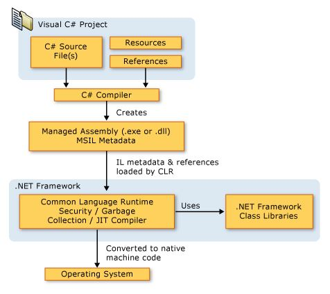

# C# 특징

## - .NET 컴파일 과정

MSIL(MicroSoft Intermediate Language) : CIL, Metadata, Manifest를 포함하고 있다.

CIL(Common Intermediate Language) : CLI 설명서에의해 정의된 최저 레벨의 사람이 읽을 수 있는 언어이다. Object oriented assembly language이다. 얘의 bytecode가 native code로 변환된다.

CLI(Common Language Infrastructure) : 그냥 .net의 설명서, compile-time, run-time시 언어에 종속적이지 않은 플랫폼을 제공함. exception, garbage collection, 보안등을 위한 S/W component를 포함하고 CLI가 구현된 것이 CLR이다.

CLR(Common Language Runtime) : assembly가 CLR위에서 동작 즉, .Net의 Runtime이다.

JIT(Just In Time) compilation : 동적 번역(dynamic translation)이라고도 하며 프로그램을 실제 시행하는 시점에 기계어로 번역하는 컴파일 기법. 프로그램의 실행 속도를 빠르게 하기 위해 사용 됨. 실행 시점에서 interpreter 방식으로 기계어 코드를 생성하면서 그 코드를 캐싱하여, 같은 함수가 여러 번 불릴 떄 매번 기계어 코드를 생성하는 것을 방지한다.

## - 기본 자료형(Primitive Types)

object :  모든 자료형의 부모 클래스
