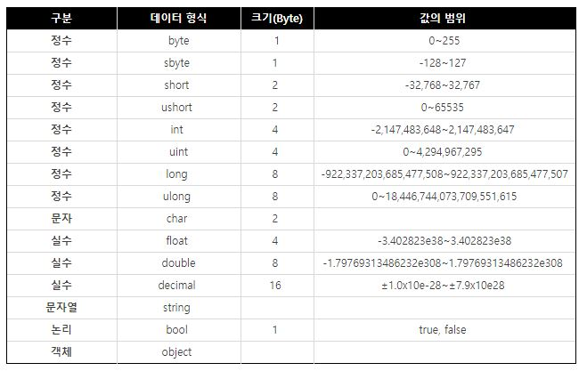
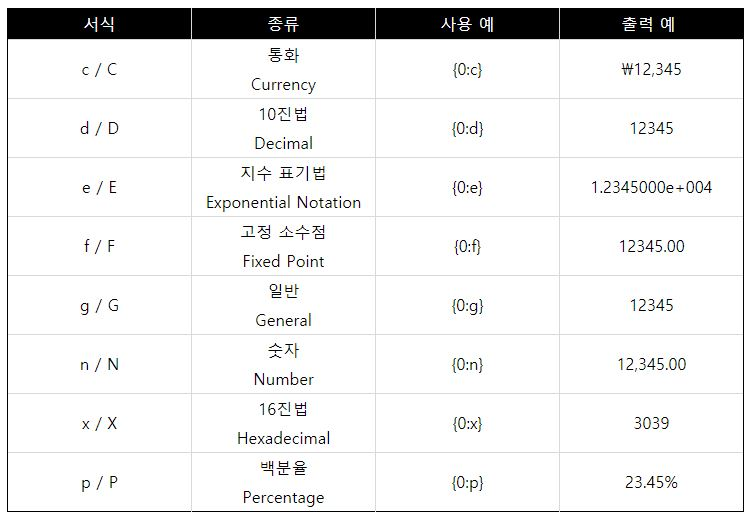
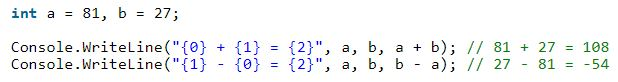
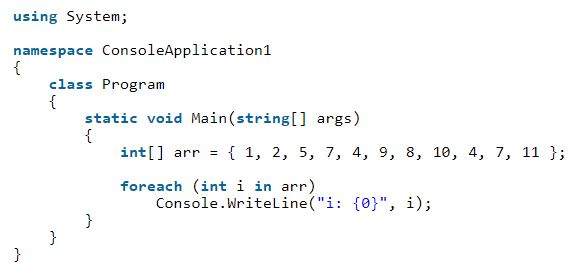

# C# 특징

## 기본 자료형(Primitive Types)

object :  모든 자료형의 부모 클래스

## Format Specifier

사용 예시

## for each

사용 예시

## call by reference

함수(**???** a, **???** b);

returnValue 함수(**???** 형 변수명, **???** 형 변수명){} 형식에서

**ref** : 메모리의 주소를 전달함. 매개변수로 사용하기 전에 초기화 필요.

**out** : ref와 같은 기능을 하지만 매개변수로 전달 시 초기화가 필요 없다.

**params** : 길이의 제한을 받지 않는 매개변수를 전달 할 수 있다.

​		ex) aa(1,2,3,4,5,6,7);

​		      static int aa(params int[] list){... list[i]이런식으로 접근 ...}

## Extension Method

public static retType method(this extensionType identifier, params...){}

ex) public static int m(this int var, int a, int b){

​		int result = var;

​		for(int i=0; i<b; ++i) {result *= a;}

​		return result;

​	}

​	static void someFunction(){

​		Console.WriteLine("{0}\n", 10.m(2, 3));

​	}

이미 빌드된 라이브러리를 참조해서 사용하고 있는데, 이 라이브러리 내부에 있는 기존의 클래스를 좀 더 확장시키고 싶을 때 확장 메소드를 통해 기존 클래스를 변경하지 않고 기능을 확장 할 수 있다. 상속을 사용해도 되지만 sealed로 한정되어 있는 경우엔 확장 메소드의 사용을 고려해야 한다.

## Partial class

partial class n{}

partial class n2{}

partial class n3{}

앞에 partial키워드가 붙은 클래스는 컴파일 시 컴파일러에 의해 하나로 합쳐짐. 분할에는 제한이 ㅇ벗다고 한다. pratial 은 interface, struct에서도 사용 될 수 있다.

