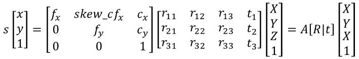

# Camera calibration

카메라 왜곡에 대한 보정 방법. 즉, 3차원 점들이 투영된 위치를 구하거나 역으로 영상좌표에서 3차원 공간 좌표를 복원할 때 내부 요인을 제거해야 정확한 계산이 가능 한데 이 값들을 구하는 과정을 캘리브레이션이라 함. 

## Calibration 개요

pinhole 카메라 모델에서 3차원 공간을 2차원 이미지 평면에 투사하는 변환 관계는 아래와 같음

- (X,Y,Z)는 월드 좌표계(world coordinate system)상의 3D 좌표

- [R|t] 월드 좌표계를 카메라 좌표계로 변환시키기 위한 회전/이동 변환 행렬, extrinsic parameter(외부 파라미터)들임.

- A는 Intrinsic camera matrix이자 intrinsic parameter(내부 파라미터)임

- A + [R|t]를 합쳐서 camera matrix, projection matrix라고 부름

## Camera Intrinsic Parameter

얘들은 캘리브레이션 툴 등을 이용하면 쉽게 구할 수 있는 애들이라 함.

**A. 초첨 거리 (focal length) : fx, fy**

카메라의 초점 거리는 렌즈 중심과 이미지 센서(CCD, CMOS 등)의 거리를 말함. 거리의 단위는 픽셀(pixel)

이미지의 픽셀은 이미지센서의 cell에 대응되는데 픽셀이 셀 크기에 대한 상대적인 값으로 표현된다는 뜻. 예를 들어 셀 크기(0.1mm), 초점거리(f=500pixel)이 있다면 렌즈 중심에서 센서까지의 거리는 셀 크기의 500배, 50mm가 됨.

그리고 초점거리가 fx,fy 두개인 이유는 셀간의 간격이 가로,세로 크기가 다를 수 있기 때문이다. 이미지 해상도를 낮출 때는 줄어드는 비율에 따라 초점 거리의 비율도 줄여야 함. 해상도 반 줄이면 초점 거리도 반 줄여야 함.

초점으로부터 거리가 1인 평면을 normalized image plane이라하고 얘의 좌표를 normalized image coorinate라고 함. 얘는 3차원을 2차원으로 변경하기 위한 가상의 이미지 평면으로 Xc, Yc 를 Zc로 나누는 것은 월드 좌표계를 normalized image coordinate로 변환하는 것임. 이 normalized image coordinate에서 초점 거리(fx,fy)를 각각 곱해주면 이미지 평면에서의 좌표가 나옴. 근데 얘는 좌측 상단 모서리를 나타내는 좌표이기 때문에 좌표를 계산할 떄는 이 (fxXc/Zc+cx, fyYc/Zc+cy) 요런식으로 접근해야 함.

**B. 주점 (princpal point)**

핀홀, 즉 카메라 렌즈의 중심에서 이미지센서에 내린 수선의 발의 영상 좌표. 얘가 영상 중심점이 아님에 주의!

영상의 모든 기하학적 해석이 주점을 이용하여 이루어지기 때문에 중요!

**C. 비대칭 계수(skew coefficient)**

비대칭 계수(skew_c)는 이미지센서의 cell array의 y축이 기울어진 정도를 나타냄(skew_c = tana).

요즘 카메라들은 이러한 비대칭 에러가 거의 없어서 얘를 고려 안 하는 경우가 있음.

## Camera Extrinsic parameter

카메라 좌표계와 월드 좌표계 사이의 변환 관계를 설명하는 매개변수, 두 좌표계 사이의 회전, 평행이동 변환으로 표현된다.

얘는 카메라 고유의 파라미터가 아니기 때문에 카메라를 어떤 위치에 어떤 방향으로 설치했는지에 따라 달라지고, 월드 좌표계를 어떻게 정의했느냐에 따라서 달라짐.

얘를 구하는 방법은 내부 변수들을 먼저 구하고. 미리 알고 있는 또는 샘플로 뽑은 3D월드 좌표 - 2D 영상좌표 매칭 쌍들을 이용하여 맨 위의 식에서 변환 행렬을 구하면 됨. opencv->solvePnP함수 이용.
