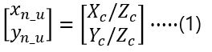
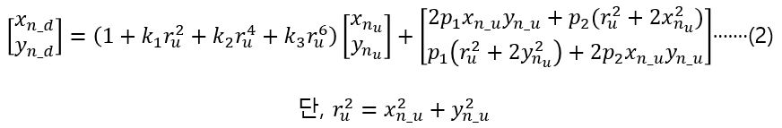
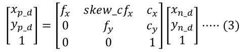
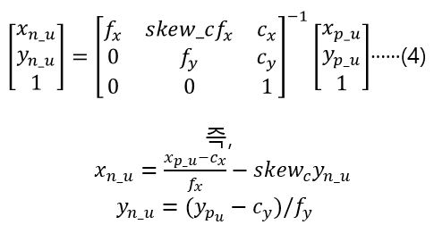

# Camera distortion

## Type of Distortion

**A. Radial Distortion(방사 왜곡)**

렌즈의 굴절률에 의한 것. 왜곡 정도가 중심에서의 거리에 의해 결정된다.

**B. Tangential Distortion(접선 왜곡)**

카메라 제조 과정에서 렌즈와 이미지센서의 수평이 맞지 않거나 렌즈 자체의 centering이 맞지 않아서 발생하는 왜곡. 타원형 형태로 왜곡 분포가 달라진다고 함.

## Mathmetical model of rense distortion

렌즈 왜곡의 수학적 모델은 카메라 내부 변수들의 영향이 제거된 normalized image plane에서 정의 됨.

렌즈 왜곡이 없을 경우 3차원 공간상의 한 점 (Xc, Yc, Zc)는 pinhole projection에 의해 normalized image plane상의 한 점으로 투영 됨(1).

여기서 u는 undistorted, d는 distorted, n은 normalized, p는 pixel

실제로는 투영 된 점은 렌즈의 비선형성으로 인해 왜곡 되는데 이 왜곡된 normalized 좌표는 (2)로 표시된다.

(2)의 아래 수식에서 첫번째 항은 radial distortion, 두번째 항은 tangential distortion

(2)의 첫번째 수식에서 k1,k2,k3은 radial distortion의 계수, p1, p2는 tangential distortion의 계수

ru는 왜곡이 없을 때의 중심(principal point)까지의 거리(반지름).

이 normalized 좌표는 normalized image plane에서의 좌표이며 얘를 영상 픽셀 좌표로 변활 할 때 카메라 내부 파라미터를 반영하여 구한다.(4)

fx, fy는 초점거리, cx,cy는 렌즈 중심 영상 좌표(principal point), skew_c는 비대칭 계수를 나타냄

## distortion correction(왜곡 보정)

내부 변수를 구하기 위해 카메라 캘리브레이션 실시함. 

왜곡된 영상을 Id, 보정된 영상을 Iu라 하면 Iu의 각 픽셀 값을 그 픽셀 좌표를 왜곡 시켰을 때의 Id의 대응되는 픽셀값으로 채우는 것.

영상 Iu의 한 점을 (xp_u, yp_u)라 하면, 얘를 (3) 함수에 역함수를 적용시켜 normalized 좌표(xn_u, yn_u)로 변환시킴.

그 다음으로 중심까지의 거리 ru를 식 (2)에 적용시켜 왜곡된 좌표 (xn_d, yn_d)를 구함.

마지막으로 (xn_d, yn_d)를 다시 픽셀 좌표계로 변환(3)하면 (xp_u, yp_u)의 왜곡된 영상에서의 좌표(xp_d, yp_d)를 구할 수 있음.
