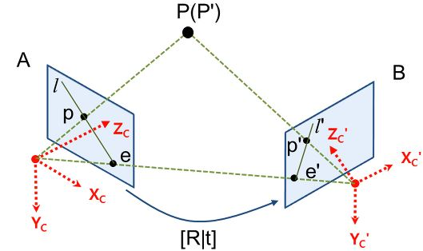

# Epipolar Geometry

동일한 object or scene에 대해 서로 다른 두 지점에서 촬영한다고 했을 때, 각 위치에서 얻은 영상들 사이의 기하학적 관계를 다루는 것.

P, P' : 3차원 공간상의 한 점.

A, B : 각 위치에서 찍어서 얻은 영상

e, e' : epipole이라 부르며 두 위치, 즉 카메라들의 원점을 잇는 선과 이미지 평면이 만나서 생긴 점이다.

p, p' : P(P')가 이미지 평면에 투영된 좌표

l, l' : p(p')와 e(e')를 잇는 직선 epiline(=epipolar line)이라고도 한다.

