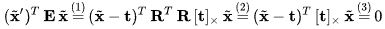

# Epipolar Geometry

동일한 object or scene에 대해 서로 다른 두 지점에서 촬영한다고 했을 때, 각 위치에서 얻은 영상들 사이의 기하학적 관계를 다루는 것.

P, P' : 3차원 공간상의 한 점.

A, B : 각 위치에서 찍어서 얻은 영상

e, e' : epipole이라 부르며 두 위치, 즉 카메라들의 원점을 잇는 선과 이미지 평면이 만나서 생긴 점이다.

p, p' : P(P')가 이미지 평면에 투영된 좌표

l, l' : p(p')와 e(e')를 잇는 직선 epiline(=epipolar line)이라고도 한다.

## Essential Matrix

컴퓨터 비전에서 essential matrix는 3 x 3 행렬임.  streao vision에서 쓰임.

**기능**

homogenous normalized image 좌표계의 이미지일 때 점 y, y'이 같은 장면의 3D점이라면 을 만족함.

**사용**

essential matrix와 fundamental matrix는 매칭 image points간 제한을 수립하는데 사용될 수 있지만, essential matrix는 normalization을 성취하기 위해서 내부 카메라 변수들을 알아야 하기 때문에 calibrated camera에 대한 관계에서만 사용 가능하다. 그러나 만약 카메라가 calibrated 되었다면 essential matrix는 카메라와 3D위치에 상응대는 영상 point들 간 관련 위치와 방향을 결정하는데 사용될 수 있다.

**derivation and definition : longuet-Higgins꺼 기준**

두개의 normalized 카메라는 3D 공간을 image plane으로 투영한다. 각 카메라 좌표 시스템에서의 점 P를 (x1, x2, x3), (x'1, x'2, x'3)이라고 할 때. 카메라가 normalized되어 있기 때문에, 연관 영상 좌표는 이다.

두 개의 이미지 좌표의 homogeneous 표현은 

이고 좀 더 간소하게 하면 

로 표현 가능하다. 이 때 y, y'들은 이차원 영상 좌표계의 homogeneous적 표현이고 x들은 적적한 3차원 좌표들이다. 

다른 normalized 카메라들의 결과는 각 좌표 시스템들은 이동과 회전의 평균과 관련이 있다는 것이다. 이것은 3차원 좌표들의 두개의 집합은 Rdl 3x3 회전 행렬이고 t가 3차원 이동 벡터일 때과 연관이 있음을 의미한다.

essential matrix는 [t]x가 t의 외적에 대한 행렬표현인 곳에서 로 정의된다.

이 essential matrix의 정의가 이미지 좌표계에 상응하는 제약을 표현하는지 보고싶다면 두개의 다른 좌표 시스템에 있는 점 P의 3차원 좌표계들을 E의 좌우로 곱해주면 된다:

 	1. 걍 수식에 위에서 설명한거 때려박음
 	2. R^t x R = I 인데 그 이유는 R이 회전 행렬이기 때문
 	3. 요거는 행렬의 외적표현의 속성이래.

요래 하면 x3, x3' > 0 이 되는데 마이너스 나오는 애들은 카메라 밖으로 나가버리는 거라고 함. 위에 식 잘 전개하면 맨 위에 식 나옴.